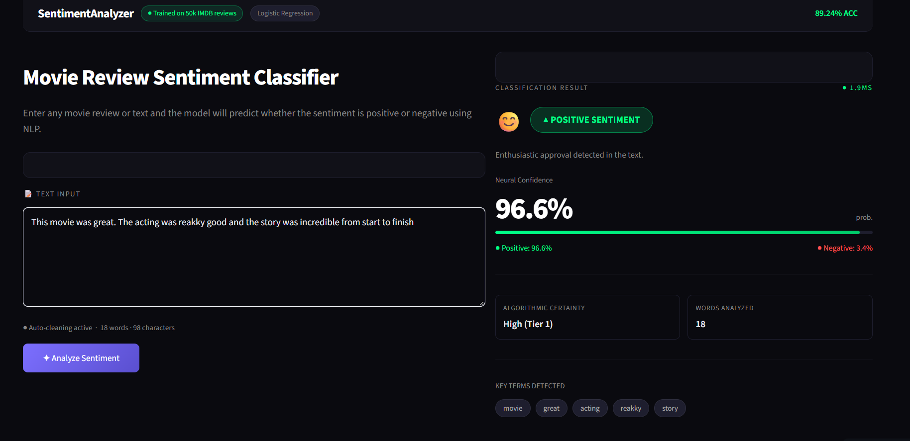

# Sentiment Analyzer

A web app that detects whether a text is positive or negative, built with Python, scikit-learn and Streamlit.

I built this project to get hands-on experience with Natural Language Processing and Machine Learning. I wanted to go beyond tutorials and actually train a model with real data, so I used 50,000 movie reviews from the IMDB dataset and got to 89% accuracy.


## Live Demo

**[sentiment-analyzer-liz.streamlit.app](https://sentiment-analyzer-liz.streamlit.app)**



## What it does

You type any text, hit analyze, and the app tells you if it's positive or negative along with a confidence score. Simple but the interesting part is everything happening under the hood.


## How I built it

1. **Data**: 50,000 real movie reviews from the IMDB dataset, already labeled as positive or negative
2. **Cleaning**: removed HTML tags, punctuation and stopwords from every review
3. **Vectorization**: converted text into numbers using TF-IDF (top 10,000 words)
4. **Model***:  trained a Logistic Regression classifier on 80% of the data
5. **Results**: tested on the remaining 10,000 reviews


## Results

| | Negative | Positive |
|---|---|---|
| Precision | 90% | 88% |
| Recall | 88% | 91% |
| F1-Score | 89% | 89% |
| **Overall Accuracy** | **89.24%** | |


## Tech Stack

- **Python**: main language
- **pandas**: loading and exploring the dataset
- **NLTK**: text cleaning and stopwords
- **scikit-learn**: TF-IDF vectorization and model training
- **Streamlit**: web interface
- **pickle**: saving and loading the trained model


## Run it locally

```bash
# Clone the repo
git clone https://github.com/lizfernandaschulte/Sentiment-Analyzer.git
cd Sentiment-Analyzer

# Create and activate virtual environment
python -m venv venv
venv\Scripts\activate

# Install dependencies
pip install -r requirements.txt
```

Download the dataset from [Kaggle](https://www.kaggle.com/datasets/lakshmi25npathi/imdb-dataset-of-50k-movie-reviews) and place it inside the `data/` folder as `IMDB Dataset.csv`, then:

```bash
# Train the model
python model.py

# Run the app
streamlit run app.py
```

## Author

**Liz Fernanda Schulte**  
Software Engineering Student  
[GitHub](https://github.com/lizfernandaschulte)· [LinkedIn](https://www.linkedin.com/in/liz-fernanda-schulte-4a1592434)
